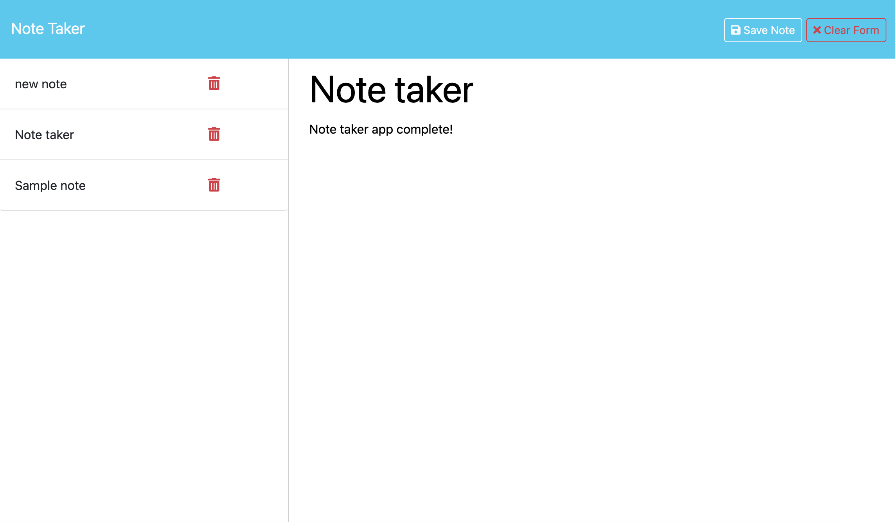

# rafa-note-taker

## Description

The goal of this project is to create a note taking app using express.js and deploy it on Heroku

## Link to webpage
## [Deployed Link]()

## Installation

N/A

## Usage

Users are able write a new note, save the note, view and delete the note. When the page is reloaded or the browser is restarted,
the notes saved notes persists.

## [Link to Video](https://drive.google.com/file/d/109Gwf0TvTjM3tbAyjoT9wbWKOPMP3XIK/view)

## Credits

N/A

## License

This project uses the MIT license

## Badges

## Features

- Users are able write and save notes.
- Users are able to delete notes.
- Saved notes persist.
